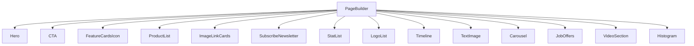
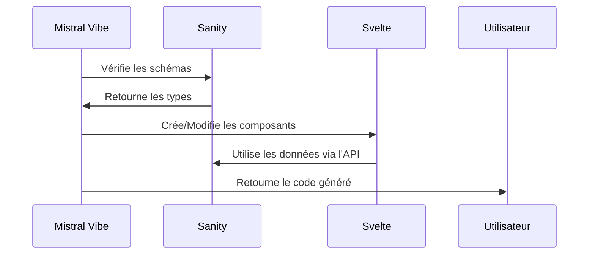

# Axeriel Svelte - Guide pour Mistral Vibe

## 📁 Structure du Projet

Ce projet est un monorepo utilisant Turborepo avec deux applications principales :

```
axeriel-svelte/
├── apps/
│   ├── web/          # Application frontend SvelteKit
│   └── studio/       # CMS Sanity (backend)
├── packages/         # Configurations partagées
└── AGENTS.md         # Ce fichier
```

## 🚀 Architecture Technique

### Stack Technique
- **Frontend**: SvelteKit 2.50.1 avec Svelte 5.48.2
- **CMS**: Sanity.io 5.7.0
- **Styling**: Tailwind CSS 4.1.18
- **Build**: Turborepo + Vite 7.3.1
- **Gestionnaire de paquets**: pnpm

### Pattern Headless CMS
- Sanity sert de backend de contenu
- SvelteKit consomme le contenu via l'API Sanity
- Prévisualisation en temps réel entre CMS et frontend
- Génération automatique de types TypeScript

## 🤖 Guide pour Mistral Vibe

### Points d'Entrée Principaux

#### Application Web (SvelteKit)
- **Page principale**: `apps/web/src/routes/+page.svelte`
- **Chargement des données**: `apps/web/src/routes/+page.server.ts`
- **Client Sanity**: `apps/web/src/lib/sanity/client.ts`
- **Requêtes GROQ**: `apps/web/src/lib/sanity/queries.ts`
- **Page Builder**: `apps/web/src/lib/components/PageBuilder.svelte`

#### Studio Sanity
- **Configuration**: `apps/studio/sanity.config.ts`
- **Schémas**: `apps/studio/schemaTypes/`
- **Types générés**: `apps/web/src/lib/sanity/sanity.types.ts`

### Architecture des Composants

Le système utilise un **Page Builder** basé sur des blocs modulaires :



### Workflow de Développement

1. **Modification des schémas Sanity**
   - Modifier les fichiers dans `apps/studio/schemaTypes/`
   - Exécuter `pnpm run type` dans le studio pour régénérer les types

2. **Développement Frontend**
   - Les composants Svelte sont dans `apps/web/src/lib/components/`
   - Les blocs du Page Builder sont dans `apps/web/src/lib/components/blocks/`
   - Utiliser les types générés depuis `apps/web/src/lib/sanity/sanity.types.ts`

3. **Requêtes de Données**
   - Ajouter/modifier les requêtes GROQ dans `apps/web/src/lib/sanity/queries.ts`
   - Utiliser le client configuré dans `apps/web/src/lib/sanity/client.ts`

## 📝 Conventions et Bonnes Pratiques

### Structure des Fichiers

```
# Pour les composants Svelte
apps/web/src/lib/components/
├── PageBuilder.svelte          # Composant principal du page builder
└── blocks/                    # Composants de blocs individuels
    ├── Hero.svelte
    ├── CTA.svelte
    └── ...

# Pour les utilitaires Sanity
apps/web/src/lib/sanity/
├── client.ts                  # Configuration du client
├── queries.ts                 # Requêtes GROQ
└── sanity.types.ts            # Types générés (NE PAS MODIFIER)
```

### Nommage
- **Composants**: PascalCase (ex: `Hero.svelte`)
- **Fichiers utilitaires**: kebab-case (ex: `sanity-client.ts`)
- **Variables**: camelCase
- **Types**: PascalCase

### Gestion des Types
- **NE JAMAIS** modifier directement `sanity.types.ts`
- Toujours générer les types via la commande Sanity
- Utiliser les types générés dans tous les composants

## 🔧 Commandes Utiles

### Développement
```bash
# Démarrer les deux applications
pnpm run dev

# Démarrer seulement le frontend
pnpm run dev --filter=web

# Démarrer seulement le studio
pnpm run dev --filter=studio
```

### Build
```bash
# Builder toutes les applications
pnpm run build

# Builder seulement le frontend
pnpm run build --filter=web
```

### Génération de Types
```bash
# Depuis le dossier studio
cd apps/studio
pnpm run type
```

### Linting et Formatage
```bash
# Linting
pnpm run lint

# Formatage
pnpm run format
```

## 🎯 Bonnes Pratiques pour Mistral Vibe

### Quand tu modifies l'application Svelte

1. **Toujours** vérifier les types générés dans `sanity.types.ts`
2. **Utiliser** les composants existants dans `components/blocks/`
3. **Suivre** la structure de données définie dans les schémas Sanity
4. **Tester** avec des données mock si nécessaire

### Pour les nouvelles fonctionnalités

1. **D'abord** définir le schéma dans Sanity (si nouveau type de contenu)
2. **Ensuite** générer les types
3. **Puis** créer le composant Svelte correspondant
4. **Enfin** l'intégrer dans le PageBuilder

### Gestion des Erreurs

Le PageBuilder a déjà un système de gestion d'erreurs intégré :
- Chargement asynchrone avec états
- Gestion des composants manquants
- Affichage des erreurs utilisateur

## 📚 Documentation Complémentaire

- [SvelteKit Documentation](https://kit.svelte.dev/docs)
- [Sanity Documentation](https://www.sanity.io/docs)
- [Turborepo Documentation](https://turborepo.dev/docs)
- [Tailwind CSS Documentation](https://tailwindcss.com/docs)

## 🔄 Intégration MCP Svelte

Ce projet utilise le MCP (Mistral Coding Protocol) pour Svelte. Voici comment l'utiliser :

### Configuration de Base

Le fichier `apps/web/AGENTS.md` contient la configuration de base pour le MCP Svelte. Voici les points clés :

1. **Version de Svelte**: 5.48.2
2. **Framework**: SvelteKit 2.50.1
3. **Styling**: Tailwind CSS 4.1.18
4. **Structure**: Monorepo avec Turborepo

### Bonnes Pratiques MCP

1. **Toujours** utiliser les types générés par Sanity
2. **Privilégier** les composants existants avant d'en créer de nouveaux
3. **Respecter** l'architecture du Page Builder
4. **Utiliser** les requêtes GROQ existantes quand possible

### Exemple de Workflow MCP



## ⚠️ Points d'Attention

1. **Ne pas modifier** les fichiers générés automatiquement
2. **Toujours** vérifier la compatibilité des versions
3. **Tester** les modifications dans un environnement isolé
4. **Documenter** les changements significatifs

## 🚀 Prochaines Étapes

1. Implémenter la récupération complète de contenu depuis Sanity
2. Construire les pages basées sur les schémas existants
3. Créer les composants Svelte manquants pour les blocs
4. Implémenter le système de page builder complet

_Last updated: 2026-01-30_