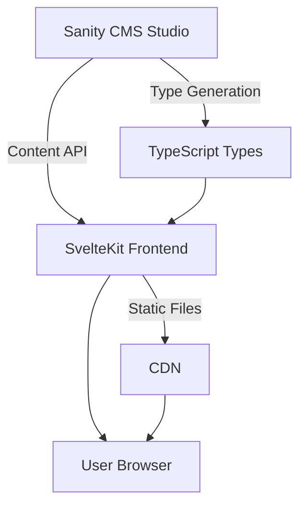
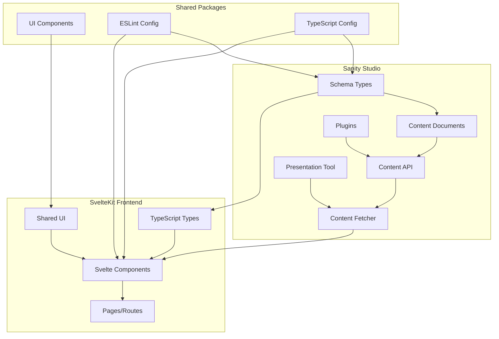
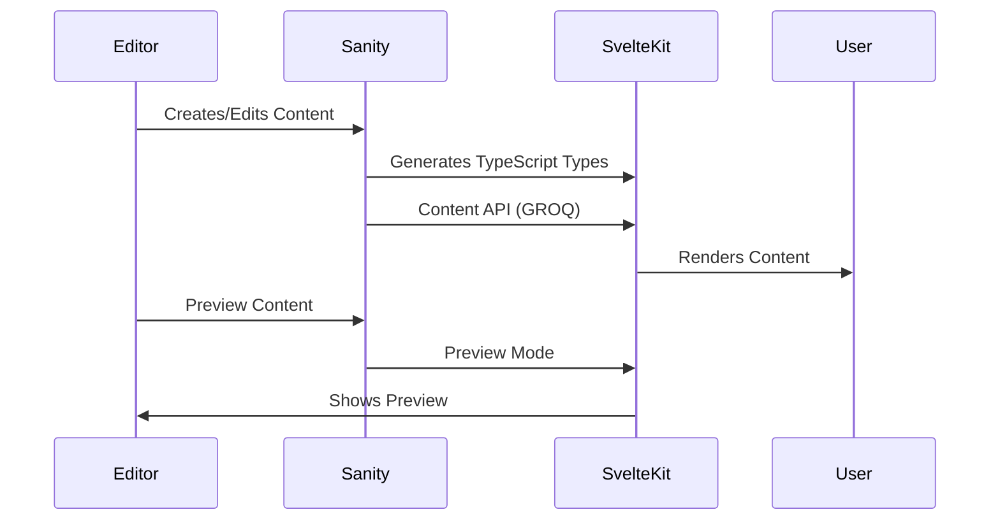

# Axeriel Svelte - Comprehensive Project Overview

## 📁 Project Structure

```
axeriel-svelte/
├── apps/
│   ├── web/          # SvelteKit frontend application
│   └── studio/       # Sanity CMS backend/studio
├── packages/
│   ├── ui/           # Shared React UI components
│   ├── eslint-config/ # Shared ESLint configuration
│   └── typescript-config/ # Shared TypeScript configuration
└── README.md         # This file
```

## 🚀 System Architecture

### High-Level Architecture Diagram



### Detailed Component Architecture



## 🏗️ Software Architect Perspective

### System Design & Architecture Patterns

1. **Monorepo Architecture**
   - Uses Turborepo for efficient dependency management
   - Clear separation between frontend and backend concerns
   - Shared packages for consistency and reusability

2. **Headless CMS Pattern**
   - Sanity serves as content backend
   - SvelteKit consumes content via API
   - Real-time preview capabilities

3. **Component-Based Architecture**
   - Svelte components for frontend
   - React components for CMS UI
   - Shared UI components package

### Scalability Considerations

- **Horizontal Scaling**: Sanity.io cloud scales automatically, SvelteKit can deploy to serverless
- **Content Modeling**: Comprehensive schema supports various content types
- **Performance**: Svelte's compile-to-JS approach + Sanity CDN

## 💻 Software Developer Perspective

### Code Structure

```
apps/
├── web/
│   ├── src/
│   │   ├── lib/          # Shared components and utilities
│   │   ├── routes/       # SvelteKit routes and pages
│   │   └── app.d.ts      # Type declarations
│   ├── static/          # Static assets
│   └── svelte.config.js # Svelte configuration
│
└── studio/
    ├── schemaTypes/     # Sanity schema definitions
    │   ├── blocks/       # Content blocks
    │   ├── definitions/  # Field definitions
    │   └── documents/    # Document types
    ├── utils/           # Utility functions
    ├── plugins/         # Custom plugins
    └── sanity.config.ts # Sanity configuration
```

### Implementation Details

1. **Sanity Configuration**
   - Environment variables integrated
   - Comprehensive plugin setup
   - Custom structure for content organization

2. **Type Generation**
   - Configured to generate types for frontend
   - TypeScript interfaces for all schema types

3. **Build Pipeline**
   - Turborepo configured for efficient builds
   - Separate build scripts for each app
   - Linting and type checking integrated

### Maintainability

- **Documentation**: Present but could be enhanced
- **Testing**: Testing strategy needs to be defined
- **Code Quality**: ESLint and Prettier configured

## 🎯 Product Manager Perspective

### Features

1. **Content Management**
   - Full-featured Sanity CMS
   - Support for blog posts, products, authors, FAQs
   - SEO and OpenGraph metadata management

2. **Frontend Presentation**
   - SvelteKit provides fast, modern frontend
   - Tailwind CSS for responsive design
   - Rich interactive experiences

3. **Integration**
   - Real-time preview between CMS and frontend
   - Type-safe content queries
   - Media handling (images, videos)

### User Flows



## 🔧 Technology Stack

### Core Technologies

- **Frontend**: SvelteKit 2.50.1 with Svelte 5.48.2
- **CMS**: Sanity.io 5.7.0
- **Styling**: Tailwind CSS 4.1.18
- **Build System**: Turborepo with Vite 7.3.1
- **Package Management**: pnpm

### Development Tools

- **Linting**: ESLint with custom configurations
- **Formatting**: Prettier
- **Type Checking**: TypeScript
- **Sanity Plugins**: Presentation, Vision, Assist, Media, Icon Picker, etc.

## 🚀 Getting Started

### Prerequisites

- Node.js 18+
- pnpm (package manager)
- Sanity CLI (for CMS operations)

### Installation

```bash
# Install dependencies
pnpm install

# Start development servers
pnpm run dev
```

### Development Commands

```bash
# Build all apps
pnpm run build

# Run linting
pnpm run lint

# Format code
pnpm run format

# Check types
pnpm run check-types
```

## 📂 Project Status

### Current State

- ✅ Turborepo setup complete
- ✅ SvelteKit application configured
- ✅ Sanity CMS studio fully configured
- ✅ Type generation configured
- ✅ Shared packages created
- ⚠️ Frontend implementation minimal (needs expansion)
- ⚠️ Content fetching not yet implemented
- ⚠️ Testing strategy not defined

### Next Steps

1. **Frontend Development**
   - Implement content fetching from Sanity
   - Build out pages based on Sanity schemas
   - Create Svelte components for content blocks

2. **Content Strategy**
   - Define content governance processes
   - Establish content workflows
   - Plan for content migration if needed

3. **Technical Enhancements**
   - Add comprehensive testing
   - Implement CI/CD pipelines
   - Enhance documentation

## 🤔 Actionable Questions

### Architecture

- Should we implement ISR (Incremental Static Regeneration)?
- How to handle authentication/authorization?
- What caching strategy for Sanity content?

### Development

- What testing framework to adopt?
- How to structure the frontend content components?
- Should we implement a design system?

### Content

- What content types are most critical?
- How to handle content localization?
- What SEO strategy to implement?

## 📚 Additional Resources

- [SvelteKit Documentation](https://kit.svelte.dev/docs)
- [Sanity Documentation](https://www.sanity.io/docs)
- [Turborepo Documentation](https://turborepo.dev/docs)
- [Tailwind CSS Documentation](https://tailwindcss.com/docs)

## 📝 License

This project is private and proprietary. All rights reserved.

---

_Last updated: 2026-01-30_
